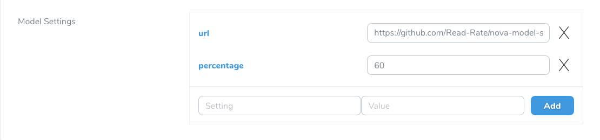

# A model-settings field for Laravel Nova

[](https://packagist.org/packages/read-rate/nova-model-settings-field)
[](https://packagist.org/packages/read-rate/nova-model-settings-field)


This package contains a Nova field to add settings to your models using the [laravel-model-settings](https://github.com/glorand/laravel-model-settings).



## Requirements

This Nova field does not support v4.0.0 of [laravel-model-settings](https://github.com/glorand/laravel-model-settings) yet.

## Installation

You can install the package in to a Laravel app that uses [Nova](https://nova.laravel.com) via composer:

```bash
composer require read-rate/nova-model-settings-field
```

## Usage

To add settings to a model you first need to make sure that one of the `HasSettingsField`, `HasSettingsTable`, `HasSettingsTrait`
trait is present.

```php
class Book extends Model
{
    
    use Glorand\Model\Settings\Traits\HasSettingsField;
    
    ...
}
```

Next you can add the new model-settings field to your Nova resource :


```php
namespace App\Nova;

use Readandrate\ModelSettingsField\ModelSettingsField;

class Book extends Resource
{
    // ...
    
    public function fields(Request $request)
    {
        return [
            // ...
            
            ModelSettingsField::make('Model Settings'),

            // ...
        ];
    }
}
```


## Testing

``` bash
composer test
```

## Changelog

Please see [CHANGELOG](CHANGELOG.md) for more information on what has changed recently.

## Contributing

Please see [CONTRIBUTING](CONTRIBUTING.md) for details.

## Security

If you discover any security related issues, please email donatien@schmitz.cc instead of using the issue tracker.

## Credits

- [Donatien Schmitz](https://github.com/Donaschmi)

## License

The MIT License (MIT). Please see [License File](LICENSE.md) for more information.
